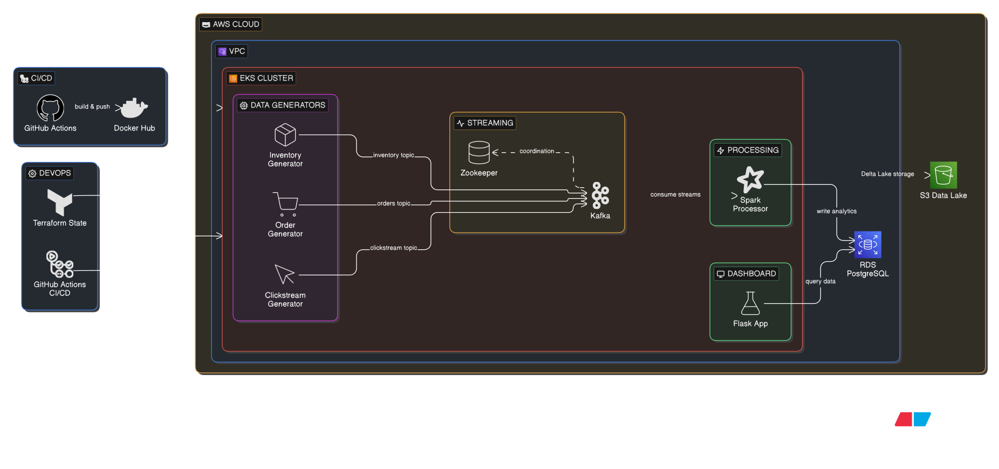

<div align="center">

# 🛍️ E-Commerce Cloud Data Pipeline
**A modern Lambda architecture for real-time analytics, fraud detection, and automated deployment.**

[](https://www.terraform.io/)
[](https://kubernetes.io/)
[](https://spark.apache.org/)
[](https://github.com/features/actions)

</div>

---

## 🧩 Architecture Overview

This repository implements a **production-grade data pipeline** for processing high-velocity simulated e-commerce data.  
It is fully provisioned using **Infrastructure as Code (IaC)** and deployed via **automated CI/CD workflows**.

| 🏗️ Infrastructure | ⚡ Streaming | 🧠 Processing | 📦 Storage |
| :---: | :---: | :---: | :---: |
| AWS EKS <br> Terraform <br> Docker Hub | Apache Kafka <br> Zookeeper <br> Chaos Generators | Apache Spark <br> PySpark <br> Structured Streaming | AWS RDS (PostgreSQL) <br> AWS S3 <br> Delta Lake |

---

## 🧩 The Architecture

<div align="center">
  
</div>

<br>

This repository contains a production-grade data engineering pipeline...
## ✨ Key Features

### 🌪️ Chaos Engineering
- Simulates schema drift, latency spikes, and fraud anomalies
- Generates realistic messy production-like data

### ⏱️ Real-Time Processing
- Windowed joins (clickstream + orders)
- Watermarking for late data
- Continuous streaming with PySpark

### 🤖 CI/CD & GitOps
- Automated GitHub Actions workflows
- Docker build and push
- Zero-downtime deployments

### 🔒 Security
- No plaintext secrets
- Terraform → Kubernetes secure injection
- Isolated configs

---

## 🏗️ Tech Stack

| Component | Technology | Description |
| :--- | :--- | :--- |
| Cloud | AWS | EKS, RDS, S3 |
| IaC | Terraform | Infrastructure provisioning |
| Orchestration | Kubernetes | Autoscaling & recovery |
| Streaming | Apache Kafka | Event pipeline |
| Processing | Apache Spark | ETL & analytics |
| Storage | Delta Lake | ACID data lake |
| CI/CD | GitHub Actions | Automation |

---

## 📁 Repository Structure

```text
ecommerce-cloud-data-pipeline/
├── .github/workflows/
├── k8s/
├── src/
├── terraform/
├── docker-compose.yml
└── README.md
```

---

## 🚀 Getting Started

### 🔧 Prerequisites

- AWS CLI (`v2.x`)
- Terraform (`v1.5+`)
- kubectl (`v1.27+`)
- Docker (`v24+`)
- Docker Hub account

### ⚙️ Deployment

#### 1. Clone the Repository

```bash
git clone https://github.com/Kevi22v/ecommerce-cloud-data-pipeline.git
cd ecommerce-cloud-data-pipeline
```

#### 2. Provision AWS Infrastructure

```bash
cd terraform
terraform init
terraform apply -auto-approve
```

> Takes about 15–20 minutes.

#### 3. Configure Kubernetes Context and Secrets

```bash
aws eks update-kubeconfig --region us-east-1 --name ecommerce-cluster
```

```bash
export DB_PASS=$(terraform output -raw db_password)
kubectl create secret generic ecommerce-secrets \
  --from-literal=DB_PASSWORD="${DB_PASS}"
```

#### 4. Deploy Kafka and Microservices

```bash
cd ../k8s
kubectl apply -f kafka.yaml
kubectl apply -f apps.yaml
kubectl get pods -w
```

---

## 🔄 CI/CD Pipeline

### Trigger
- Push to `main` or `chore`

### Steps
1. Lint code
2. Build Docker images
3. Push to Docker Hub
4. Deploy to EKS

### Required Secrets
- `AWS_ACCESS_KEY_ID`
- `AWS_SECRET_ACCESS_KEY`
- `DOCKERHUB_USERNAME`
- `DOCKERHUB_TOKEN`

---

## 💸 Cleanup

```bash
cd terraform
terraform destroy -auto-approve
```

---

## 📌 Summary

- Real-time pipeline (Kafka + Spark)
- Cloud-native infra (EKS + Terraform)
- Automated CI/CD
- Secure and scalable design